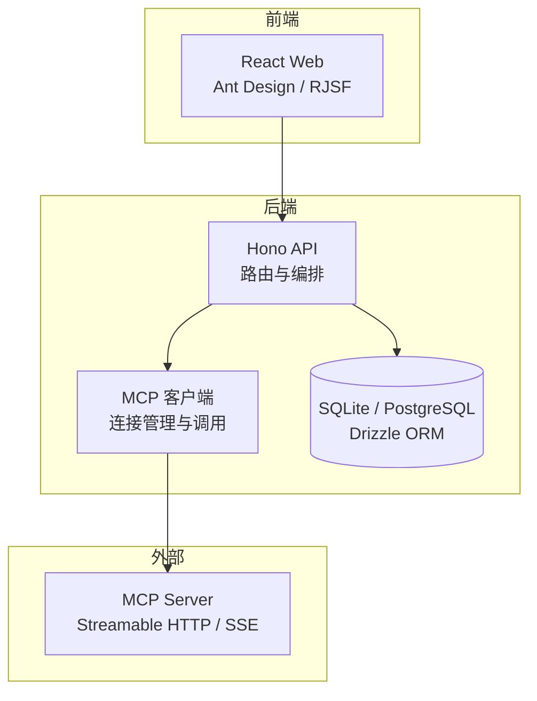
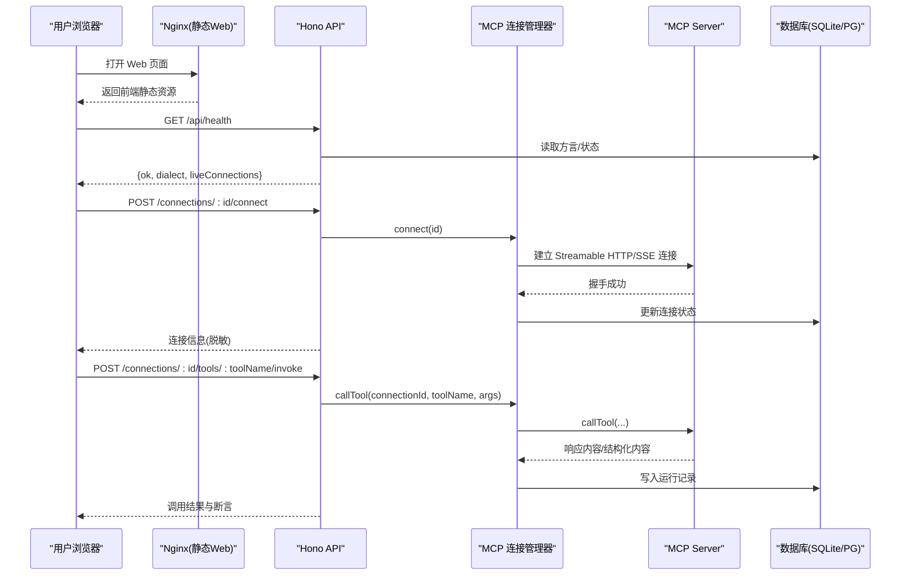
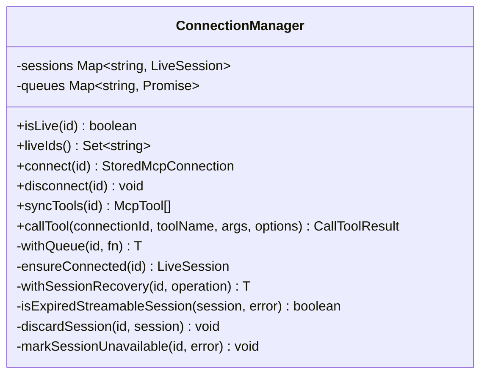
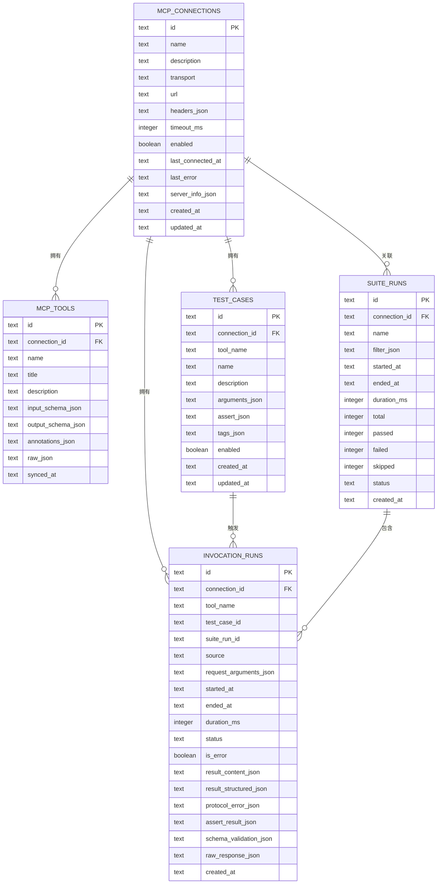
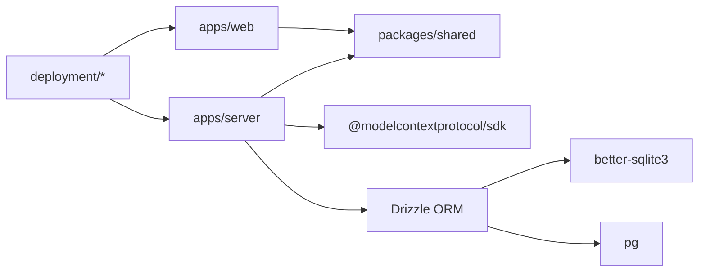

# 项目概述

<cite>
**本文引用的文件列表**   
- [README.md](file://README.md)
- [package.json](file://package.json)
- [apps/server/src/index.ts](file://apps/server/src/index.ts)
- [apps/server/src/routes/api.ts](file://apps/server/src/routes/api.ts)
- [apps/server/src/mcp/connection-manager.ts](file://apps/server/src/mcp/connection-manager.ts)
- [apps/server/src/db/client.ts](file://apps/server/src/db/client.ts)
- [apps/server/src/db/repos.ts](file://apps/server/src/db/repos.ts)
- [packages/shared/src/types.ts](file://packages/shared/src/types.ts)
- [apps/web/src/App.tsx](file://apps/web/src/App.tsx)
- [apps/web/src/pages/ConnectionsPage.tsx](file://apps/web/src/pages/ConnectionsPage.tsx)
- [deployment/Dockerfile](file://deployment/Dockerfile)
- [deployment/docker-compose.yaml](file://deployment/docker-compose.yaml)
- [deployment/README.md](file://deployment/README.md)
</cite>

## 目录
1. [简介](#简介)
2. [项目结构](#项目结构)
3. [核心组件](#核心组件)
4. [架构总览](#架构总览)
5. [详细组件分析](#详细组件分析)
6. [依赖关系分析](#依赖关系分析)
7. [性能与可扩展性](#性能与可扩展性)
8. [快速开始](#快速开始)
9. [故障排查指南](#故障排查指南)
10. [结论](#结论)

## 简介
MCP Tool Debug 是一个可自托管的 Web 调试台，用于连接、检查、调用和自动化测试 Model Context Protocol（MCP）Tools。它将 MCP Inspector、JSON Schema 2020-12 动态表单、结果诊断、测试用例与回归执行集中到同一界面中，帮助开发者在“从一次调通到稳定回归”的全流程中高效定位问题并验证变更。

核心价值
- 统一工作台：连接管理、工具发现、参数调试、结果诊断、断言与批量回归一体化。
- 协议兼容：支持 Streamable HTTP 与 SSE，自动回退；会话过期安全重试。
- 类型与校验：基于 JSON Schema 2020-12 的动态表单与输出校验，降低手写错误成本。
- 可观测与可复现：记录每次调用与套件历史，便于回归定位。
- 团队共享：SQLite/PostgreSQL 双数据库，Docker Compose 一键部署。

适用场景
- MCP Server 开发：提交前快速验证 Tool Schema、参数与返回语义。
- MCP Client/Agent 集成：排查传输、Headers、超时与会话生命周期问题。
- QA 与回归测试：将手工调试沉淀为断言用例，批量验证多个 Tools。
- 团队共享环境：通过 Docker 与 PostgreSQL 提供统一的调试入口。
- Schema 兼容性验证：覆盖 oneOf/anyOf/required/outputSchema 等特性。

章节来源
- [README.md:1-193](file://README.md#L1-L193)

## 项目结构
本项目采用前后端分离的 Monorepo 组织方式：
- apps/server：后端 API（Hono + TypeScript），负责 MCP 客户端封装、数据持久化与业务编排。
- apps/web：前端 UI（React 18 + Ant Design），提供连接管理、工作区、自动化与设置页面。
- packages/shared：前后端共享的类型定义与工具函数。
- deployment：容器化构建与编排（Dockerfile、docker-compose.yaml、Nginx 配置）。

图表来源
- [apps/server/src/index.ts:1-39](file://apps/server/src/index.ts#L1-L39)
- [apps/server/src/routes/api.ts:1-277](file://apps/server/src/routes/api.ts#L1-L277)
- [apps/server/src/mcp/connection-manager.ts:1-383](file://apps/server/src/mcp/connection-manager.ts#L1-L383)
- [apps/server/src/db/client.ts:1-267](file://apps/server/src/db/client.ts#L1-L267)
- [apps/web/src/App.tsx:1-66](file://apps/web/src/App.tsx#L1-L66)

章节来源
- [package.json:1-48](file://package.json#L1-L48)
- [apps/web/src/App.tsx:1-66](file://apps/web/src/App.tsx#L1-L66)

## 核心组件
- 后端服务入口：初始化迁移、CORS、挂载路由与健康检查。
- API 路由层：连接、工具、用例、运行记录与导入导出接口。
- MCP 连接管理器：多传输适配、会话恢复、并发队列、超时控制与调用编排。
- 数据访问层：Drizzle ORM 抽象 SQLite/PostgreSQL，统一映射与查询。
- 共享类型：前后端一致的 MCP 连接、工具、用例、运行与断言模型。
- 前端应用：路由与页面组织，连接管理、工作区与自动化页面。

章节来源
- [apps/server/src/index.ts:1-39](file://apps/server/src/index.ts#L1-L39)
- [apps/server/src/routes/api.ts:1-277](file://apps/server/src/routes/api.ts#L1-L277)
- [apps/server/src/mcp/connection-manager.ts:1-383](file://apps/server/src/mcp/connection-manager.ts#L1-L383)
- [apps/server/src/db/client.ts:1-267](file://apps/server/src/db/client.ts#L1-L267)
- [apps/server/src/db/repos.ts:1-660](file://apps/server/src/db/repos.ts#L1-L660)
- [packages/shared/src/types.ts:1-229](file://packages/shared/src/types.ts#L1-L229)
- [apps/web/src/App.tsx:1-66](file://apps/web/src/App.tsx#L1-L66)

## 架构总览
系统采用前后端分离模式：
- 前端 React 应用由 Nginx 提供静态资源，并通过反向代理转发 /api 请求至后端。
- 后端 Hono 服务暴露 RESTful API，内部使用 MCP TypeScript SDK 与目标 MCP Server 通信。
- 数据持久化通过 Drizzle ORM 同时支持 SQLite（本地/容器内）与 PostgreSQL（生产）。
- 容器化以 node:22-alpine 为基础镜像，API 与 Web 分阶段构建与运行。

图表来源
- [apps/server/src/index.ts:1-39](file://apps/server/src/index.ts#L1-L39)
- [apps/server/src/routes/api.ts:1-277](file://apps/server/src/routes/api.ts#L1-L277)
- [apps/server/src/mcp/connection-manager.ts:1-383](file://apps/server/src/mcp/connection-manager.ts#L1-L383)
- [apps/server/src/db/client.ts:1-267](file://apps/server/src/db/client.ts#L1-L267)
- [apps/server/src/db/repos.ts:1-660](file://apps/server/src/db/repos.ts#L1-L660)

## 详细组件分析

### 后端服务入口与路由
- 启动流程：加载环境变量、执行数据库迁移、创建 Hono 实例、启用 CORS、挂载 /api 路由与健康检查。
- 健康检查：返回当前数据库方言与在线连接数，便于编排与监控。
- 路由职责：连接 CRUD、工具同步与查询、工具调用、用例与套件运行、历史记录与导入导出。

章节来源
- [apps/server/src/index.ts:1-39](file://apps/server/src/index.ts#L1-L39)
- [apps/server/src/routes/api.ts:1-277](file://apps/server/src/routes/api.ts#L1-L277)

### MCP 连接管理器
- 多传输适配：根据连接配置选择 streamable_http 或 sse，auto 模式按顺序尝试。
- 会话恢复：当 Streamable HTTP 返回 404 时，自动丢弃旧会话并重试一次，提升稳定性。
- 并发控制：每个连接维护一个串行队列，避免同一连接并发冲突。
- 超时控制：调用级超时与 AbortController 配合，区分超时与协议错误。
- 调用编排：封装 callTool，计算耗时、标记状态、进行输出 Schema 校验并返回结构化结果。

图表来源
- [apps/server/src/mcp/connection-manager.ts:1-383](file://apps/server/src/mcp/connection-manager.ts#L1-L383)

章节来源
- [apps/server/src/mcp/connection-manager.ts:1-383](file://apps/server/src/mcp/connection-manager.ts#L1-L383)

### 数据访问层与模型
- 方言推断：根据 DATABASE_URL 与 DB_DIALECT 决定 SQLite 或 PostgreSQL。
- 表结构：连接、工具、用例、套件运行与调用记录，包含索引优化查询。
- 映射器：统一将 JSON 字段解析为对象，屏蔽底层差异。
- 事务与迁移：启动时执行 DDL，确保表存在与索引就绪。

图表来源
- [apps/server/src/db/client.ts:69-245](file://apps/server/src/db/client.ts#L69-L245)

章节来源
- [apps/server/src/db/client.ts:1-267](file://apps/server/src/db/client.ts#L1-L267)
- [apps/server/src/db/repos.ts:1-660](file://apps/server/src/db/repos.ts#L1-L660)

### 共享类型与断言模型
- 传输类型：streamable_http、sse、auto。
- 运行状态：success、tool_error、protocol_error、timeout、cancelled。
- 断言配置：支持期望 isError、structuredContent 校验、文本包含/排除、最大耗时、JSONPath 匹配等。
- 导出包：包含连接与用例，便于跨环境迁移。

章节来源
- [packages/shared/src/types.ts:1-229](file://packages/shared/src/types.ts#L1-L229)

### 前端应用与页面
- 路由布局：顶部导航切换连接、自动化与设置页，默认重定向到连接页。
- 连接管理：新增/编辑/删除连接，显示在线状态与最近错误，支持导入导出。
- 工作区与自动化：后续页面承载工具调用、表单生成、结果查看与套件执行。

章节来源
- [apps/web/src/App.tsx:1-66](file://apps/web/src/App.tsx#L1-L66)
- [apps/web/src/pages/ConnectionsPage.tsx:1-291](file://apps/web/src/pages/ConnectionsPage.tsx#L1-L291)

## 依赖关系分析
- 前端依赖：React Router、Ant Design、RJSF/Ajv（动态表单）、CodeMirror（JSON 编辑）。
- 后端依赖：Hono、@modelcontextprotocol/sdk、Drizzle ORM、better-sqlite3、pg。
- 构建与编排：Node 22 Alpine、Nginx、dumb-init、Docker Compose。

图表来源
- [package.json:1-48](file://package.json#L1-L48)
- [apps/server/src/index.ts:1-39](file://apps/server/src/index.ts#L1-L39)
- [apps/server/src/mcp/connection-manager.ts:1-383](file://apps/server/src/mcp/connection-manager.ts#L1-L383)
- [apps/server/src/db/client.ts:1-267](file://apps/server/src/db/client.ts#L1-L267)
- [deployment/Dockerfile:1-64](file://deployment/Dockerfile#L1-L64)
- [deployment/docker-compose.yaml:1-39](file://deployment/docker-compose.yaml#L1-L39)

章节来源
- [package.json:1-48](file://package.json#L1-L48)
- [deployment/Dockerfile:1-64](file://deployment/Dockerfile#L1-L64)
- [deployment/docker-compose.yaml:1-39](file://deployment/docker-compose.yaml#L1-L39)

## 性能与可扩展性
- 连接级串行队列：避免同一 MCP 连接的并发竞争，保证调用有序。
- 会话恢复：针对 Streamable HTTP 404 的自动重建，减少人工干预。
- 超时控制：调用级超时与 AbortController 结合，防止长尾阻塞。
- 数据库索引：对常用查询字段建立索引，提高列表与筛选性能。
- 并行套件：runSuite 支持并行度配置，适合批量回归。

[本节为通用指导，不直接分析具体文件]

## 快速开始

### 本地开发
- 要求 Node.js 20+，推荐 22。
- 克隆仓库后安装依赖并启动开发模式，前端与后端将同时热重载。
- 访问：
  - Web UI：<http://localhost:5173>
  - API 健康检查：<http://localhost:8787/api/health>

章节来源
- [README.md:51-73](file://README.md#L51-L73)
- [package.json:31-40](file://package.json#L31-L40)

### Docker 部署
- 使用 docker-compose 一键拉起 API 与 Web 服务，默认端口 8787（API）与 5173（Web）。
- 首次运行会自动生成 .env，可按需修改 CORS_ORIGIN、端口与数据库 URL。
- 管理命令：status/logs/restart/down。

章节来源
- [deployment/README.md:1-32](file://deployment/README.md#L1-L32)
- [deployment/docker-compose.yaml:1-39](file://deployment/docker-compose.yaml#L1-L39)
- [deployment/Dockerfile:1-64](file://deployment/Dockerfile#L1-L64)

## 故障排查指南
- 连接失败
  - 现象：连接按钮报错或显示离线。
  - 排查：确认 URL、传输类型与 Headers；查看连接卡片中的 lastError；检查后端日志。
- 会话过期（Streamable HTTP 404）
  - 现象：调用时报错或连接不稳定。
  - 机制：连接管理器检测到 404 会丢弃旧会话并安全重试一次；若仍失败则标记不可用。
- 超时
  - 现象：调用长时间无响应。
  - 处理：调整连接超时或单次调用超时；关注是否被上游限流。
- 数据库
  - SQLite：默认文件路径位于容器卷 mcp-tool-debug-data；重启不会丢失数据。
  - PostgreSQL：确保 DATABASE_URL 正确且网络可达，特殊字符需 URL 编码。
- 健康检查
  - 使用 /api/health 判断服务可用性与方言，便于编排与监控。

章节来源
- [apps/server/src/mcp/connection-manager.ts:175-268](file://apps/server/src/mcp/connection-manager.ts#L175-L268)
- [apps/server/src/routes/api.ts:32-38](file://apps/server/src/routes/api.ts#L32-L38)
- [apps/server/src/db/client.ts:247-267](file://apps/server/src/db/client.ts#L247-L267)
- [deployment/docker-compose.yaml:1-39](file://deployment/docker-compose.yaml#L1-L39)

## 结论
MCP Tool Debug 以清晰的模块化设计与完善的容错机制，覆盖了 MCP Server 开发与集成的关键痛点：复杂 Schema 输入、错误分类、结果可视化、用例沉淀与回归验证。其前后端分离架构、双数据库支持与容器化方案，既满足个人开发效率，也具备团队协作与生产部署能力。建议在生产环境中结合反向代理、HTTPS 与访问控制，进一步提升安全性与可运维性。