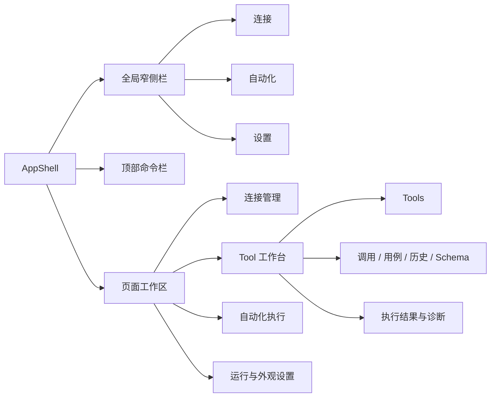
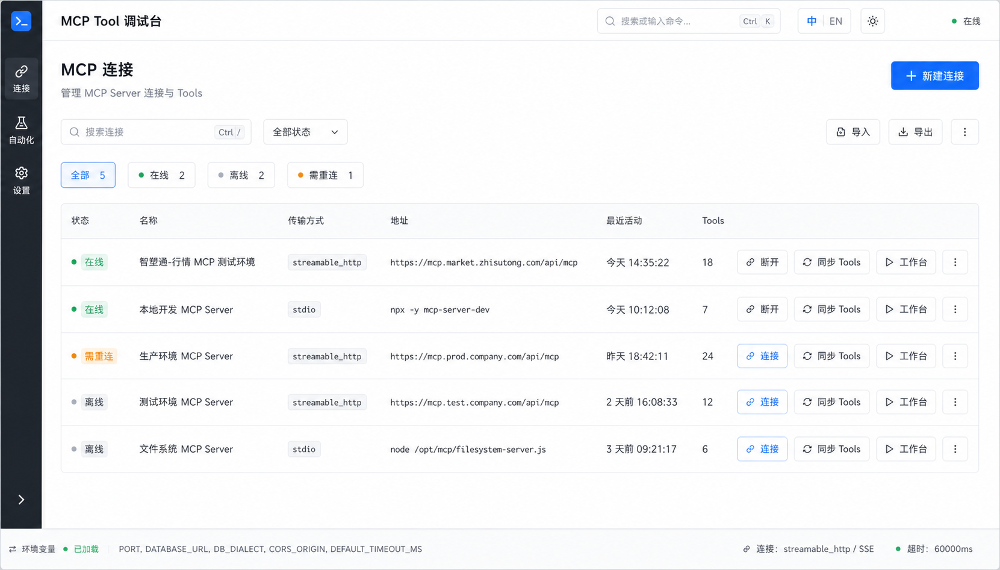
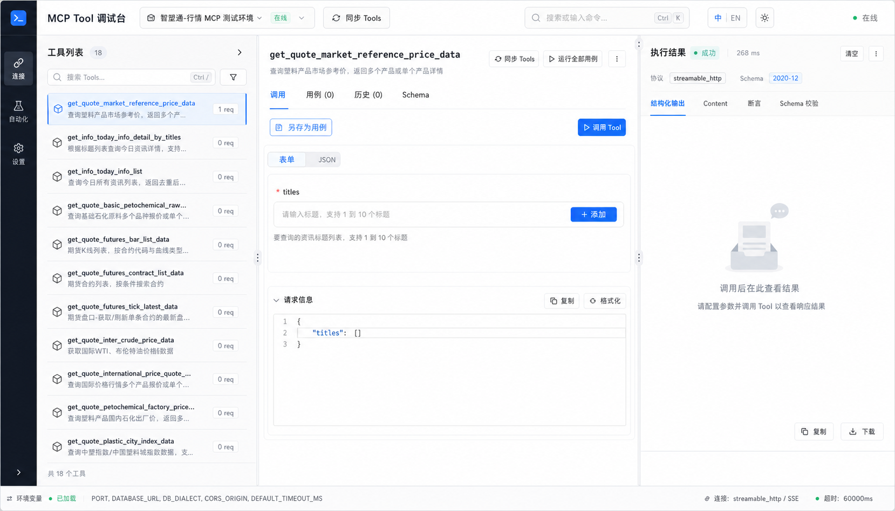
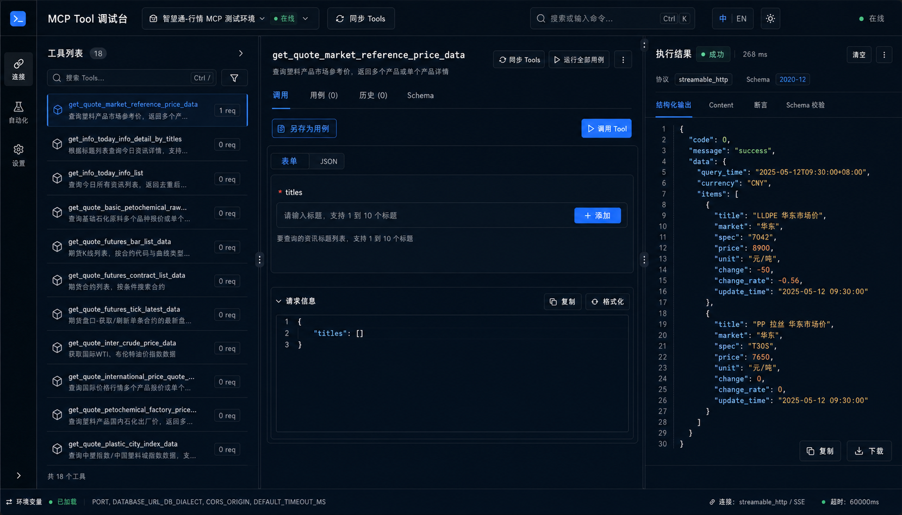
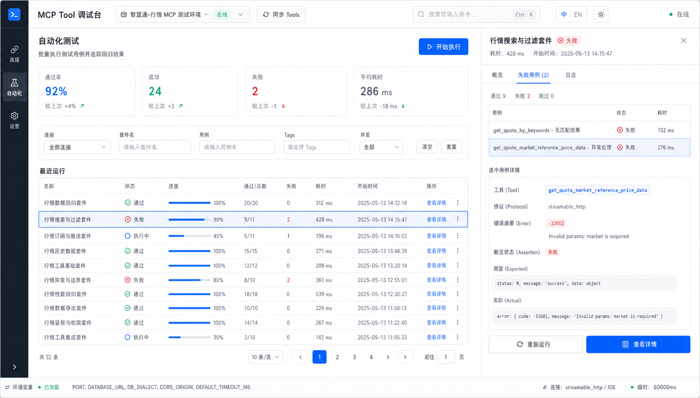
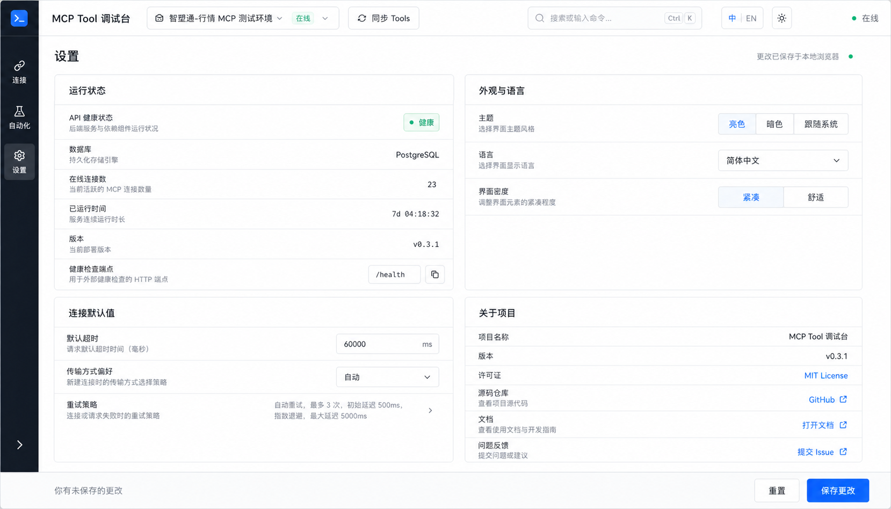

# MCP Tool 调试台 UI 设计规范

> 本文档定义 MCP Tool 调试台的界面结构、视觉语言、组件行为和验收标准，供产品设计、前端开发、代码审查及开源贡献者共同使用。

| 项目 | 内容 |
| --- | --- |
| 文档版本 | 1.0 |
| 设计状态 | 已确认，可进入前端实施 |
| 默认语言 | 简体中文（`zh-CN`） |
| 预留语言 | English（`en-US`） |
| 主题 | 亮色、暗色、跟随系统 |
| 目标设备 | 桌面浏览器，最低有效宽度 1024px |
| 前端基础 | React 18、Ant Design 5、RJSF 6、CodeMirror |

## 1. 目标与边界

本次设计希望把产品从“默认组件拼接的管理页面”提升为一套清晰、紧凑、适合长时间使用的开发者工具界面。

设计主要解决以下问题：

- 页面级操作、面板级操作和危险操作混在一起，用户难以判断下一步。
- 工作台三栏权重失衡：结果区占据大量空白，参数表单空间不足。
- 连接卡片同时平铺连接、断开、同步、工作台和删除，操作层级不清晰。
- 自动化页面缺少运行摘要、进度表达和失败定位入口。
- 设置页面只是运行信息表，无法承载主题、语言和默认行为配置。
- 状态主要依赖颜色，长 Tool 名称、长 URL 和英文文案容易破坏布局。

本规范不改变以下内容：

- 后端 API、数据库结构和 MCP 调用协议。
- 现有 Tool、用例、运行记录和连接数据模型。
- RJSF、Ajv 2020、CodeMirror 和 Ant Design 技术选型。
- 低于 1024px 的完整移动端工作流。

概念图用于表达布局和视觉方向，其中的示例地址、时间、版本号、状态和统计数据不代表真实产品配置。实现发生冲突时，以本文档的行为规则和实际接口数据为准。

## 2. 调研结论与设计原则

### 2.1 调研结论

现有 1920px 工作台中，Tools 列约 280px、调用区约 420px、结果区约 1130px。该布局在尚未调用时产生大面积空白，同时复杂 JSON Schema 表单被压缩到最窄区域。

新的布局参考 API Client 和 IDE 类工具的高密度工作方式：

- 使用窄侧栏承载稳定的全局导航。
- 使用命令栏承载当前上下文、搜索、语言和主题。
- 使用可调整、可折叠的面板处理复杂工作流。
- 使用细边框和层级背景区分区域，减少重复卡片和阴影。
- 用“状态摘要 → 详细内容 → 原始数据”的顺序帮助用户定位问题。

界面可借鉴 Hoppscotch 等开源 API 工具的信息密度和工作区组织，但不得复制其品牌、图标、颜色或具体组件外观。

### 2.2 设计原则

1. **任务优先**：每个页面或面板只有一个主要操作。
2. **状态可诊断**：协议错误、Tool `isError`、Schema 错误和断言失败必须明确区分。
3. **紧凑但不拥挤**：默认使用 32px 控件和 8px 基础间距，依靠分组而不是空白制造层级。
4. **上下文不丢失**：切换 Tool、标签或结果展示模式时，尽可能保留已填写的数据和面板宽度。
5. **渐进披露**：常用操作直接展示，低频操作和危险操作进入更多菜单。
6. **双语安全**：布局需容纳约 1.3 倍中文长度的英文文案。
7. **无障碍优先**：颜色不是唯一状态信号，键盘焦点始终可见。

## 3. 信息架构



### 3.1 全局窄侧栏

- 展开宽度为 60px，允许收起到 44px。
- 固定展示连接、自动化、设置三个入口。
- 当前页面同时使用背景、左侧指示条和文字/图标颜色表达选中状态。
- 图标按钮必须有可访问名称和 Tooltip。
- 底部可放置折叠按钮，不放置业务主操作。

### 3.2 顶部命令栏

- 高度 56px，始终位于页面顶部。
- 左侧展示产品名称或当前连接选择器。
- 中间展示搜索/命令入口，建议支持 `Ctrl/⌘ + K`。
- 右侧依次展示语言、主题和全局连接状态。
- 工作台可在命令栏展示当前连接、传输方式和在线状态；普通页面不重复展示无关连接操作。

### 3.3 页面标题栏

- 页面标题、说明和主要操作保持同一水平层级。
- 标题 24px，说明 13px；标题区与内容区间距为 20–24px。
- 主要操作位于右侧，按钮文案使用动词开头。
- 导入、导出、刷新等次级操作不得抢占主要按钮颜色。

## 4. 页面规范

### 4.1 连接管理页



桌面端使用列表而不是大卡片。列表主体整行可进入工作台，但操作列中的按钮不得触发行跳转。

建议列顺序：

| 列 | 内容 | 行为 |
| --- | --- | --- |
| 状态 | 在线、离线、需重连、连接中 | 图标、颜色和文字同时表达 |
| 名称 | 连接名称与可选说明 | 单行省略，悬停展示全文 |
| 传输方式 | `streamable_http`、`sse`、`auto` | 使用中性代码标签 |
| 地址 | MCP Endpoint | 中间省略，支持复制 |
| 最近活动 | 最近连接或同步时间 | 使用本地化相对/绝对时间 |
| Tools | 已同步 Tool 数量 | 数字右对齐 |
| 操作 | 连接/断开、同步、工作台、更多 | 禁止平铺删除按钮 |

页面规则：

- “新建连接”是页面唯一主要按钮。
- 搜索、状态筛选和结果数量放在列表上方同一工具栏。
- 在线连接展示“断开”，其他状态展示“连接”，不能同时展示两个互斥动作。
- “同步 Tools”必须展示加载状态并防止重复点击。
- 编辑、导出单连接、复制配置和删除放入更多菜单。
- 删除必须二次确认，并明确说明会删除哪些关联数据。
- 0 条连接时展示创建引导；筛选无结果时展示清除筛选入口。

### 4.2 Tool 工作台





#### 面板比例

- Tools 面板：默认 280px，最小 220px，最大 360px。
- 调用面板：占剩余区域约 55%，最小 520px。
- 结果面板：占剩余区域约 45%，最小 420px。
- 分隔手柄视觉宽度 1px，交互热区至少 8px。
- 用户拖动后的宽度按连接 ID 保存在本地。
- 每个面板提供折叠/恢复能力，折叠后保留可识别的垂直入口。

#### Tools 面板

- 面板头部展示“工具列表”、数量、搜索框和筛选入口。
- Tool 名称使用等宽字体，说明使用系统字体。
- 选中项使用左侧强调线、浅色背景和高对比文字。
- Tool 名称单行省略，描述最多两行；完整内容通过 Tooltip 查看。
- 支持键盘上下选择，`Enter` 打开选中 Tool。

#### 调用面板

- 面板头部展示 Tool 名称、说明和低频更多菜单。
- 一级标签固定为“调用、用例、历史、Schema”。
- “同步 Tools”和“运行全部用例”位于工作台工具栏，保持次级样式。
- “调用 Tool”是调用标签内唯一主要按钮，位于可见且稳定的位置。
- “另存为用例”是次级动作，不得与调用按钮同色。
- 表单/JSON 使用分段控制器切换，切换不得丢失当前参数。
- 请求信息预览默认折叠，展开后提供复制和格式化。

#### 结果面板

- 顶部结果摘要展示状态、耗时、协议和 Schema 版本。
- 第一层诊断必须区分：
  - 协议/连接错误
  - Tool 返回 `isError`
  - 输出 Schema 校验失败
  - 断言失败
  - 成功
- 内容标签建议为“结构化输出、Content、断言、Schema 校验、原始响应”。
- 复制和下载属于结果工具，不使用主要按钮样式。
- 尚未调用时展示短说明和调用引导，不占用大面积装饰图。
- 长错误信息、URL 和 JSON 必须可换行或横向滚动，不能撑破面板。

### 4.3 自动化测试页



页面由运行摘要、筛选工具栏、运行列表和详情面板组成。

运行摘要：

- 展示通过率、成功数、失败数和平均耗时。
- 数值使用等宽数字或等宽字体特性。
- 趋势仅在有可比较数据时展示，不能伪造百分比。
- 卡片高度控制在 96–112px，禁止作为装饰性大卡片。

筛选和执行：

- 连接、套件名、用例、Tags、并发属于同一筛选工具栏。
- “开始执行”是页面唯一主要按钮。
- “清空”和“重置”不能同时出现；统一使用“重置筛选”。
- 执行期间按钮切换为进度状态，并提供安全的取消入口（后端支持时）。

运行列表：

- 状态包含通过、失败、执行中、已取消。
- 状态使用图标、文字和颜色共同表达。
- 执行中展示真实进度；未知总数时使用不确定进度样式。
- 点击行或“查看详情”打开右侧详情面板。
- 失败详情优先展示失败用例、错误类型、摘要、期望值与实际值。
- “重新运行”是次级操作；只有详情上下文中的“查看完整详情”可以作为强调动作。

### 4.4 设置页



设置页使用两列分区布局，内容最大宽度建议为 1480px，避免单列表格横跨整个屏幕。

四个分区：

1. **运行状态**：API 健康、数据库方言、在线连接数、运行时间、版本和健康检查地址。
2. **外观与语言**：亮色/暗色/跟随系统、简体中文/English、紧凑/舒适密度。
3. **连接默认值**：默认超时、传输方式偏好和重试策略说明。
4. **关于项目**：版本、MIT License、GitHub、文档和 Issue 入口。

设置规则：

- 标签和说明位于左侧，控件或值位于右侧。
- 即时生效的外观设置不展示保存按钮。
- 需要持久化的设置发生变化后，底部出现保存条。
- 保存成功后清晰提示；离开未保存页面时进行确认。
- 运行状态为只读信息，不能伪装成可编辑输入框。

## 5. 视觉系统

### 5.1 语义颜色

业务组件只能使用语义 token，不得直接写十六进制颜色。

| Token | 亮色 | 暗色 | 用途 |
| --- | --- | --- | --- |
| `--ui-bg-canvas` | `#F7F9FC` | `#0B0F17` | 应用画布 |
| `--ui-bg-surface` | `#FFFFFF` | `#111827` | 面板、列表、表单 |
| `--ui-bg-subtle` | `#F3F6FA` | `#151C2B` | 次级区域、悬停 |
| `--ui-bg-elevated` | `#FFFFFF` | `#182235` | 弹层、菜单、抽屉 |
| `--ui-text-primary` | `#0F172A` | `#F8FAFC` | 标题和正文 |
| `--ui-text-secondary` | `#475569` | `#CBD5E1` | 说明和辅助信息 |
| `--ui-text-muted` | `#64748B` | `#94A3B8` | 占位和弱信息 |
| `--ui-border` | `#DCE3ED` | `#273244` | 主边框和分隔 |
| `--ui-border-subtle` | `#E9EEF5` | `#1E293B` | 行分隔和内边框 |
| `--ui-primary` | `#2563EB` | `#3B82F6` | 主要操作、焦点 |
| `--ui-primary-hover` | `#1D4ED8` | `#60A5FA` | 主要操作悬停 |
| `--ui-success` | `#059669` | `#34D399` | 成功、在线 |
| `--ui-warning` | `#D97706` | `#FBBF24` | 警告、需重连 |
| `--ui-error` | `#DC2626` | `#F87171` | 错误、失败、危险 |
| `--ui-info` | `#0284C7` | `#38BDF8` | 信息和运行中 |

状态浅背景应由状态色与 surface 混合产生，不直接复用饱和状态色作为大面积背景。

### 5.2 Ant Design token 映射

| Ant Design token | 语义来源 |
| --- | --- |
| `colorPrimary` | `--ui-primary` |
| `colorBgLayout` | `--ui-bg-canvas` |
| `colorBgContainer` | `--ui-bg-surface` |
| `colorBgElevated` | `--ui-bg-elevated` |
| `colorText` | `--ui-text-primary` |
| `colorTextSecondary` | `--ui-text-secondary` |
| `colorBorder` | `--ui-border` |
| `colorBorderSecondary` | `--ui-border-subtle` |
| `colorSuccess` | `--ui-success` |
| `colorWarning` | `--ui-warning` |
| `colorError` | `--ui-error` |
| `controlHeight` | `32` |
| `borderRadius` | `6` |
| `fontSize` | `14` |

暗色主题基于 Ant Design `darkAlgorithm`，再覆盖语义 token；业务组件不得自行判断主题后切换颜色。

### 5.3 字体

```css
--ui-font-sans: Inter, "Segoe UI", "PingFang SC", "Microsoft YaHei", system-ui, sans-serif;
--ui-font-mono: "JetBrains Mono", "SFMono-Regular", Consolas, monospace;
```

| 层级 | 字号/行高 | 字重 | 用途 |
| --- | --- | --- | --- |
| 页面标题 | 24/32 | 650 | 页面名称 |
| 区域标题 | 18/26 | 600 | 设置分区、列表区 |
| 面板标题 | 16/24 | 600 | Tools、执行结果 |
| 正文 | 14/22 | 400 | 表单、表格、正文 |
| 辅助文字 | 12/18 | 400 | 描述、时间、提示 |
| 代码 | 13/20 | 400/500 | JSON、Tool、URL、耗时 |

Tool 名称、Schema 字段、JSON、URL 和时间数值使用等宽字体；中文说明不得使用等宽字体。

### 5.4 间距、尺寸与圆角

- 基础间距：4px。
- 常用间距：4、8、12、16、24、32px。
- 控件高度：默认 32px；表格紧凑行高 44–48px。
- 图标按钮：视觉尺寸 16px，点击区域不小于 32×32px。
- 面板内边距：12–16px；页面边距：20–24px。
- 控件圆角：6px；面板圆角：8px；模态框/抽屉圆角：10px。
- 面板不使用明显阴影；只有弹层使用 `0 12px 32px rgba(15, 23, 42, 0.14)`。
- 主导航层级 `z-index: 100`，粘性工具栏 `90`，Popover/Dropdown 由 Ant Design 管理。

## 6. 组件设计契约

### 6.1 `AppShell`

- 组合窄侧栏、命令栏和页面容器。
- 提供当前路由、主题、语言、导航折叠状态。
- 页面不得自行复制全局导航或主题切换入口。

### 6.2 `PageHeader`

- 接收标题、说明、面包屑、主要操作和次级操作。
- 主要操作最多一个；次级操作超过两个时使用更多菜单。
- 1024–1279px 时说明可换行，操作区保持可见。

### 6.3 `StatusBadge`

- 由图标、文字和可选浅背景组成。
- 支持 `success`、`warning`、`error`、`processing`、`neutral`。
- 禁止只输出一个无文本色点作为关键状态。

### 6.4 `ActionMenu`

- 承载编辑、复制配置、导出和删除等低频操作。
- 危险操作放在菜单末尾并使用分隔线。
- 打开菜单后支持方向键、`Enter` 和 `Escape`。

### 6.5 `EmptyState`

- 包含简短标题、一句原因或下一步和最多一个操作。
- 业务空状态优先使用简单线性图标，不使用大面积插画。
- 搜索无结果与系统无数据必须使用不同文案。

### 6.6 `ResultSummary`

- 固定展示最终状态、耗时和错误类别。
- 可附加协议、Schema、断言等元信息标签。
- 错误状态必须包含可复制的错误摘要。

### 6.7 数据表格

- 表头 12–13px、正文 13–14px。
- 首要识别字段左对齐，数值与耗时右对齐。
- 行操作固定在右侧；横向滚动时保持可访问。
- 不使用仅靠整行红色背景表达失败的方式。
- 加载时使用骨架行；刷新时保留旧数据并显示局部进度。

## 7. 表单与 JSON Schema

RJSF 表单继续使用 `@rjsf/antd`，但需统一覆盖以下表现：

- Label 永远位于对应字段上方，不使用仅 Placeholder 的字段。
- 必填标识放在字段名旁，并提供错误文本。
- 字段说明紧跟控件，使用 12px 次级文字。
- `oneOf`/`anyOf` 选择器位于分支字段上方。
- 选择分支后只展示当前分支独有字段；父级公共字段只展示一次。
- 缺失 `title` 的分支使用 required 字段生成“填写 product_name”等可读标题。
- 切换分支时保留公共字段；清理不可见分支的互斥数据前需遵循 Schema 行为。
- 数组使用清晰的“添加项”按钮；删除和排序操作绑定到具体数组项。
- 嵌套对象使用弱边框分区，不无限叠加 Card 和阴影。
- 校验失败时，字段就地展示错误，面板顶部提供可跳转的错误摘要。
- 表单模式提交必须走 RJSF 原生校验；JSON 模式提交使用当次解析结果。
- 表单/JSON 切换不得因 React 异步状态导致提交旧参数。

CodeMirror 规范：

- JSON 编辑器使用等宽 13px 字体和明确行号。
- 亮暗主题随应用主题切换。
- 只读 Schema 与可编辑请求必须有不同标题和只读提示。
- 复制、格式化和下载位于编辑器工具栏，不漂浮在内容区域。

## 8. 操作与反馈

### 8.1 操作层级

| 层级 | 样式 | 示例 |
| --- | --- | --- |
| Primary | 实心主色 | 新建连接、调用 Tool、开始执行、保存更改 |
| Secondary | 默认边框 | 同步 Tools、另存为用例、重新运行 |
| Tertiary | 文本或无边框 | 复制、格式化、查看详情 |
| Destructive | 红色，仅在确认上下文 | 删除连接、删除用例 |

同一区域不得出现两个含义相近的主要按钮。按钮文案必须使用明确动作，避免“确定”“处理”等脱离上下文的表述。

### 8.2 异步状态

- 点击后立即进入 loading，并禁用可能产生重复副作用的操作。
- 超过 300ms 的任务展示局部进度；超过 3s 提供解释性状态。
- 成功反馈使用短 Toast；需要阅读或继续操作的结果留在页面内。
- 失败反馈不得只使用顶部 Toast，应在任务上下文中保留错误信息。
- Session 404 自动恢复时显示“会话已过期，正在重新连接”，恢复成功后不弹出错误。

### 8.3 确认与撤销

- 删除连接、用例和历史记录必须确认。
- 确认框描述对象名称和影响范围。
- 可恢复操作优先提供撤销；不可恢复操作明确标注。
- 导出凭据前继续保留敏感信息警告。

### 8.4 键盘操作

| 快捷键 | 行为 |
| --- | --- |
| `Ctrl/⌘ + K` | 打开全局搜索/命令入口 |
| `Ctrl/⌘ + Enter` | 在调用面板提交 Tool |
| `Ctrl/⌘ + S` | 保存当前用例或设置 |
| `Ctrl/⌘ + Shift + F` | 格式化当前 JSON |
| `Escape` | 关闭菜单、Popover、抽屉或模态框 |

快捷键不得覆盖浏览器关键行为；输入法组合期间不得触发提交。

## 9. 状态与错误规范

| 状态 | 用户可见表达 | 主要动作 |
| --- | --- | --- |
| 加载 | 骨架或局部 Spinner，保留布局 | 等待或取消 |
| 空数据 | 原因、下一步、一个操作 | 新建/同步 |
| 离线 | 灰色状态图标与“离线” | 连接 |
| 需重连 | 琥珀图标、原因和最近错误 | 重新连接 |
| 协议错误 | 红色错误摘要、HTTP/JSON-RPC 信息 | 复制诊断 |
| Tool `isError` | “Tool 返回错误”，保留 Content | 检查参数/重试 |
| Schema 错误 | 字段错误与路径列表 | 跳转字段 |
| 断言失败 | 期望值、实际值和失败断言 | 查看详情 |
| 无权限 | 锁形图标和所需权限说明 | 返回/重新认证 |

错误文案结构：**发生了什么 → 可能原因 → 用户下一步**。原始错误可折叠展示，但不能替代可读摘要。

## 10. 响应式规则

| 宽度 | 行为 |
| --- | --- |
| ≥ 1440px | 完整窄侧栏、命令栏和三栏工作台 |
| 1280–1439px | Tools 缩至 240px，页面间距缩至 16px |
| 1024–1279px | 侧栏收起；结果区改为可切换面板或抽屉 |
| < 1024px | 展示桌面使用提示，可浏览基础状态，不支持完整调试流 |

额外规则：

- 连接列表在 1024–1279px 隐藏次要列，将其内容放入行详情。
- 自动化详情使用抽屉覆盖，不压缩主表格到不可读宽度。
- 设置页在 1280px 以下由两列变为单列。
- 英文模式下优先折叠次级操作，不压缩主要按钮文本。

## 11. 无障碍规范

- 正文和关键控件达到 WCAG 2.2 AA 对比度。
- 键盘焦点使用 2px 主色描边和 2px 外偏移，暗色主题仍清晰可见。
- 所有图标按钮提供 `aria-label` 和 Tooltip。
- 状态同时使用图标、文字和颜色，不以颜色作为唯一信息。
- 表单错误通过 `aria-describedby` 关联字段，首次提交失败后聚焦错误摘要。
- 面板拖动手柄提供 `separator` 语义、方向键调整和当前尺寸信息。
- Toast 不作为唯一错误载体；重要错误保留在页面中。
- 动效遵循 `prefers-reduced-motion`，主题切换和面板动画不超过 180ms。
- 点击目标不小于 32×32px；相邻图标按钮间距至少 4px。

## 12. 中英文案规范

### 12.1 术语

| 中文 | English | 备注 |
| --- | --- | --- |
| 连接 | Connections | 导航使用复数 |
| 自动化 | Automation | 不使用 Auto Test |
| 设置 | Settings |  |
| 同步 Tools | Sync Tools | Tool/Tools 不翻译为“工具”时保持一致 |
| 运行全部用例 | Run all cases | 避免 Run all |
| 调用 Tool | Invoke Tool | 协议语义使用 Invoke |
| 用例 | Cases | 测试上下文使用 Test cases 也可 |
| 历史 | History |  |
| 结构化输出 | Structured output |  |
| 协议/连接错误 | Protocol/connection error |  |
| Tool 返回错误 | Tool returned an error | 对应 `isError` |
| Schema 校验 | Schema validation | Schema 保留英文 |
| 需重连 | Reconnect required | 不只写 Warning |

### 12.2 写作规则

- 中文按钮使用“动词 + 对象”，例如“同步 Tools”“删除用例”。
- 英文按钮使用 sentence case，例如 “Sync Tools”，不用全大写。
- 保留 MCP、Tool、Tools、Schema、JSON、SSE 和 HTTP 等技术术语。
- 同一页面不要混用“执行 Tool”“运行 Tool”“调用 Tool”，统一使用“调用 Tool”。
- 错误文案不责备用户，不使用“非法参数”，优先使用“参数不符合 Schema”。
- 时间、数字和日期使用当前语言环境格式化，不在组件中拼接固定中文单位。
- 按钮不得设置固定文本宽度；英文模式可换行的说明文本最多两行。

## 13. 实施映射

建议按以下顺序实施，避免页面各自发展出不同样式：

1. 建立语义 token、亮暗主题和密度配置。
2. 实现 `AppShell`、窄侧栏、命令栏和 `PageHeader`。
3. 实现共享状态、空状态、操作菜单和结果摘要组件。
4. 重构工作台面板比例、折叠和响应式行为。
5. 重构连接、自动化和设置页面。
6. 统一 RJSF、CodeMirror、表格和错误反馈。
7. 增加中英文资源和键盘/无障碍测试。

现有组件映射：

| 当前实现 | 目标 |
| --- | --- |
| `App.tsx` 顶部 Menu | `AppShell` + 窄侧栏 + 命令栏 |
| `styles.css` 全局颜色 | 语义 CSS 变量与 Ant Design token |
| `ResizablePanels` | 增加折叠、键盘调整和响应式模式 |
| `SchemaForm` | 套用统一表单、分支和错误规范 |
| `ResultViewer` | 增加 `ResultSummary` 和错误类别层级 |
| 页面内联 `style` | 共享布局组件和语义 class/token |

## 14. 验收清单

### 视觉一致性

- [ ] 五张概念稿中的侧栏、命令栏、颜色、控件密度和操作层级一致。
- [ ] 亮暗主题使用同一语义 token，业务组件无硬编码主题色。
- [ ] 每个页面或面板最多一个主要按钮。
- [ ] 危险操作不与日常操作平铺。

### 布局

- [ ] 1920、1440、1280、1024px 宽度均无横向页面溢出。
- [ ] 工作台调用面板在完整三栏模式下不小于 520px。
- [ ] 长 Tool 名称、URL、错误信息和 JSON 不撑破面板。
- [ ] 英文文案按约 1.3 倍长度仍可识别和操作。

### 交互

- [ ] 加载、空数据、离线、需重连、协议错误、`isError`、Schema 错误、断言失败和无权限均有明确状态。
- [ ] 表单/JSON、`oneOf`/`anyOf` 和面板切换不会意外丢失数据。
- [ ] 删除、导出凭据和未保存离开均有正确确认。
- [ ] 面板宽度、主题和语言选择能够持久化。

### 无障碍

- [ ] 键盘可以到达导航、面板、表单、表格操作和弹层。
- [ ] 焦点指示清晰，状态不依赖颜色。
- [ ] 重要文字与背景达到 WCAG 2.2 AA 对比度。
- [ ] 图标按钮、拖动手柄和错误信息具有正确的可访问名称或关联。

## 相关文档

- [项目 README](../README.md)
- [贡献指南](../CONTRIBUTING.md)
- [部署说明](../deployment/README.md)
- [安全策略](../SECURITY.md)

